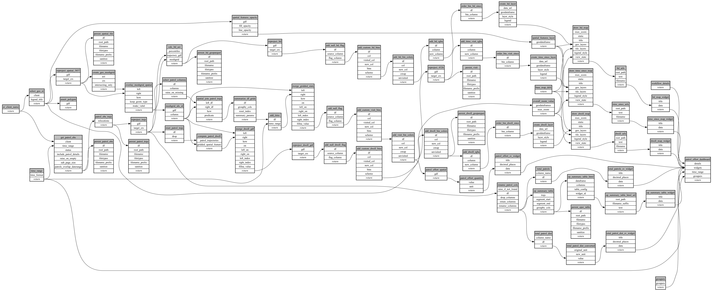

```
# AUTOGENERATED BY ECOSCOPE-WORKFLOWS; see fingerprint in README.md for details

```

```yaml
# fingerprint:
artifacts_sha256_basic: 9cd75af9855149747efc6beeefd14e743c73872f3e4d83e9563e52f5509e30a8
artifacts_sha256_strict: 9c6949076dbe86211080b80a8423c38b7a123f3bbd8a7e1149a7fd7e352f9cdf
installed_requirements:
- channel: https://repo.prefix.dev/ecoscope-workflows/
  name: ecoscope-workflows-core
  version: {version: ==0.22.17}
- channel: https://repo.prefix.dev/ecoscope-workflows/
  name: ecoscope-workflows-ext-ecoscope
  version: {version: ==0.22.17}
- channel: https://repo.prefix.dev/ecoscope-workflows-custom/
  name: ecoscope-workflows-ext-custom
  version: {version: ==0.0.56}
- channel: https://repo.prefix.dev/ecoscope-workflows-custom/
  name: ecoscope-workflows-ext-ste
  version: {version: ==0.0.18}
- channel: conda-forge
  name: pydeck
  version: {version: ==0.9.2}
- channel: https://repo.prefix.dev/ecoscope-workflows-custom/
  name: ecoscope-workflows-ext-distance-sample-counts
  version: {version: ==0.0.8}
params_sha256: fefffee881c5852cdb44165aa578f8b18ff06565cae9b5f027854232964e1697
spec_sha256: 5ca12c157e24213ea29caa7da86c570d3d347e5ca6d8bea64b6c9e0710e1bd2b

```

# ecoscope-workflows-patrol-field-effort-workflow


